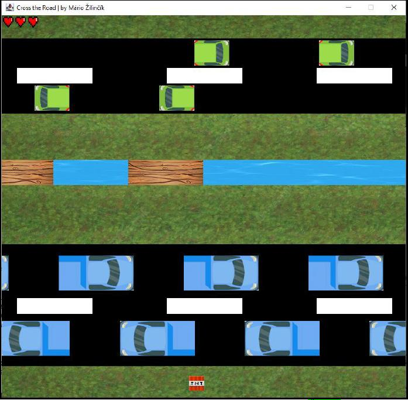
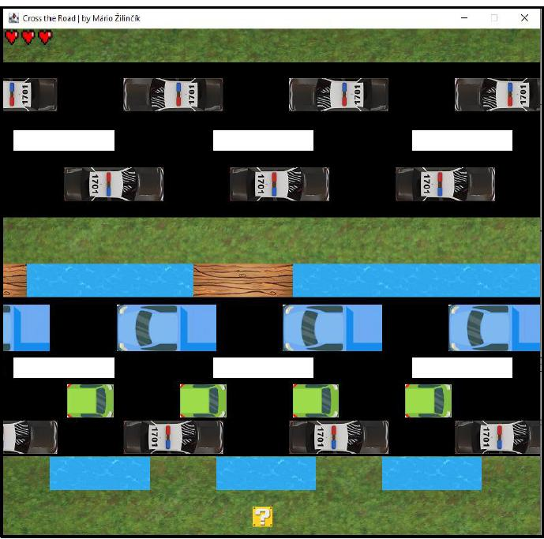
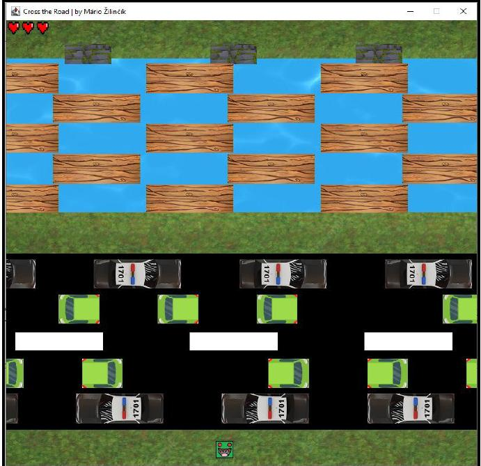

# 🏁 Cross The Road - 2D Arcade Game

**Cross The Road** is a **2D arcade game** developed in **Java**, where players must navigate their character safely across a busy road while avoiding moving obstacles like cars and water hazards. The game provides a simple yet challenging experience, testing the player's reaction time and strategic movement.

---

## 🎮 Features
- **Dynamic obstacles** – Moving cars and water hazards with randomized behavior.
- **Simple but engaging gameplay** – Move across the road step by step while avoiding collisions.
- **Score tracking** – Keeps track of successful crossings.
- **Smooth movement** – Optimized event handling for responsive controls.
- **Basic collision detection** – Prevents invalid movements and detects interactions with obstacles.

---

## 🛠️ Technologies Used
- **Java** – Core programming language.
- **Java Swing & Graphics2D** – UI rendering and game graphics.
- **Event-driven input handling** – Keyboard-based movement.
- **Basic game loop** – Ensures smooth rendering and obstacle movement.
- **File handling (optional)** – Saving and loading scores.

---

## 📸 Screenshots
Here are some screenshots of the game in action:

  

<h3 align="center">🏁 Level 1</h3>

  

<h3 align="center">🚗 Level 2</h3>

  

<h3 align="center">🏆 Level 3</h3>

---
